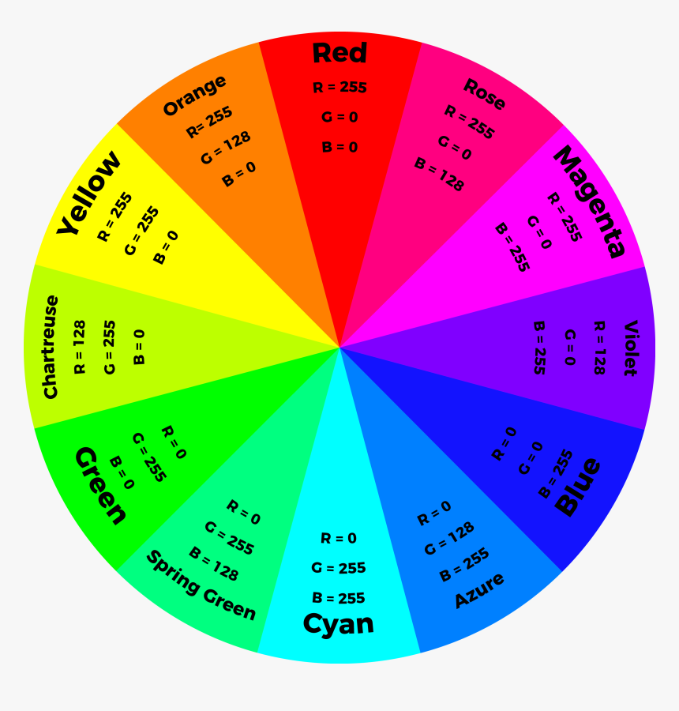
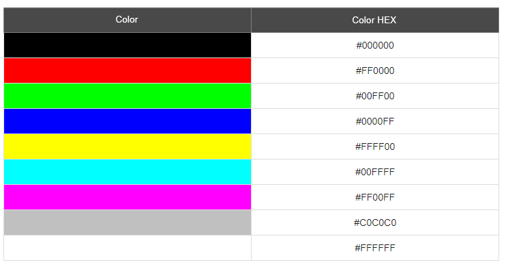
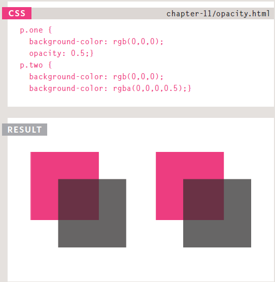
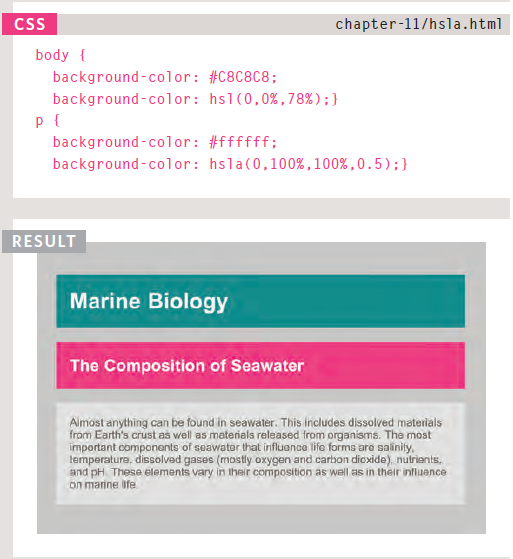

# Introducing CSS  
* **CSS** treats each **HTML** element as if it appears inside its own box and uses rules to indicate how that element should look.
* Rules are made up of selectors (that specify the elements the rule applies to) and declarations (that indicate what these elements should look like).
* Different types of selectors allow you to target your rules at different elements.
* Declarations are made up of two parts: the properties of the element that you want to change, and the values of those properties. For example, the font-family property sets the choice of font, and the value arial specifies Arial as the preferred typeface.
* **CSS** rules usually appear in a separate document, although they may appear within an **HTML** page.  
  
# Color  
* We can specify any ***color*** in **CSS** in one of three ways:
    1. **rgb values**: These express colors in terms of how much red, green and blue are used to make it up  

      
      
    2. **hex codes**: These are six-digit codes that represent the amount of *red*, *green* and *blue* in a color, preceded by a pound or hash **# sign**.  
      
      
      
    3. **color names**: There are 147 predefined color names that are recognized by browsers. Like (red, dark blue, gray...etc)  
      
      
## Background Color
we can change the **background color** of any **HTML** element, **tag** or specific part using the **`
`** tag  

  

## Understanding Color  
There are many terms that are usful to understand when choosing a color as a backgroung, like:
* Every color on a computer screen is created by mixing amounts of *red*, *green*, and *blue*
* *Saturation*: Saturation refers to the amount of **gray** in a color.
* *Brightness*: Brightness (or "value") refers to how much **black** is in a color.
* *Contrast*: When picking foreground and background colors, it is important to ensure that there is enough contrast for the text to be legible.
  
  
## CSS 3: Opacity  
* ***opacity***: CSS3 introduces the opacity property which allows you to specify the opacity of an element and any of its child elements. The value is a number between 0.0 and 1.0 (so a value of 0.5 is 50% opacity and 0.15 is 15% opacity).  
* ***rgba***: The CSS3 rgba property allows you to specify a color, just like you would with an RGB value, but adds a fourth value to indicate opacity. This value is known as an alpha value and is a number between 0.0 and 1.0 (so a value of 0.5 is 50% opacity and 0.15 is 15% opacity). The rgba value will only affect the element on which it is applied
(not child elements).  
  
  
  
## CSS3: HSL & HSLA  
* *HSL* stands for **Hue**,**Saturation** and **lightness**. from this we can derive that the **hsl** system allow the user to determine the previous properties in one line,where H range from 0 to 360, S expressed as a percentage and L also expressed as a percentage.
* *HSLA* is as *HSL** but with the addition of **A** which stands for *ALpha*. **Alpha** is a property to control transparency just like the **opacity** property.  

  

  