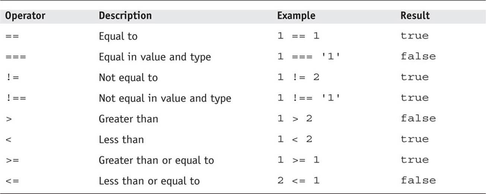

# Comparision Operators  
* we can compre any value in javascript with an/other valu/es, and the result will be either **true** or **false**  
* it is recommended to use restricted comparision. this is achieved by adding an equal sign to the operator (=)
* here are the list of operators in javascript:  

  
  
# Logical Operators  
* **Logical Operators** allow us to compare the result of one ore more of **comparision operators**  
* we have three **logical operators** **AND(&&)**,**OR(`||`)** and **NOT(!)**  

  
  
# Loops
* in **loops** a code will run only, if a condition is returned **true**, and it will keep running this code until the condition returns **false**
* we will discuss two types of loops, the **for loop** and the **while loop**
* **for llops** are most common. the condition of this type is based on a counter, for the loop is intended to run several times. when this counter reaches its end, then the condition will become **false** and the loop ends  

  

* **while loops** are used when the number of times of operation is not predefined. here the loop will run as long as the condition is met.  

