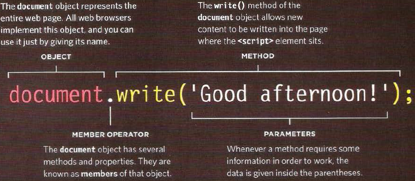
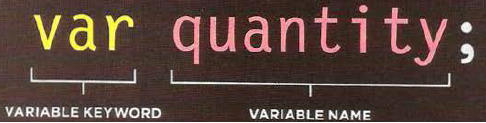

# Dynamic web pages with JavaScript
* If there is no **CSS** rule sets on a web page, the browser will apply the default sittings. If there is, then the browser will request the ruke set
* The **interpreter** (a part of the browser) translate **JS** code into instructions that the browser can perform.
* **HTML** is where the contents lives
* **CSS** state how the HTML content is presented (backgrounds, borders, box dimensions, colors, fonts, etc.)
* **JavaScript** makes the content and the presentation dynamic and interactive.
* We link scripts imto **HTML** file by using this tag `<script>`
* If you view the source code of the page in the browser, the JavaScript will not have changed the HTML, because the script works with the model of the web page that the browser has created.
* We write multi comments by putting oue whole text between these signs `/* text */` and to write a single comment we put // befor the comment
* **Objects** are a very important entity in **JS** and Objects contains **Methods**, another important tool in **JS**
  
* we can define variables in **JS** by: ***(var = a value)***. variables can be changed and modified and left without a vlue. They can hold text, numbers and true or false values
  
* We have three **data types** in **JS**, Numbers, Strings and booleans
