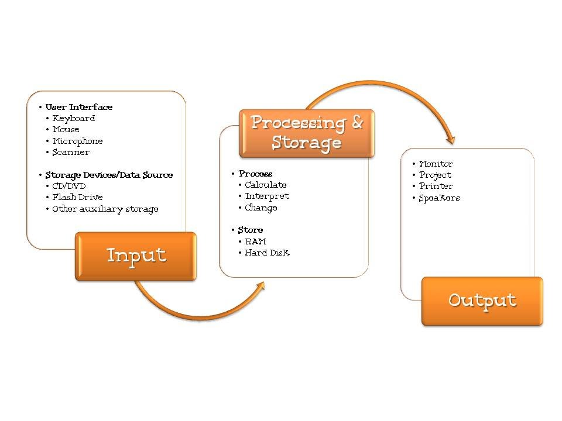
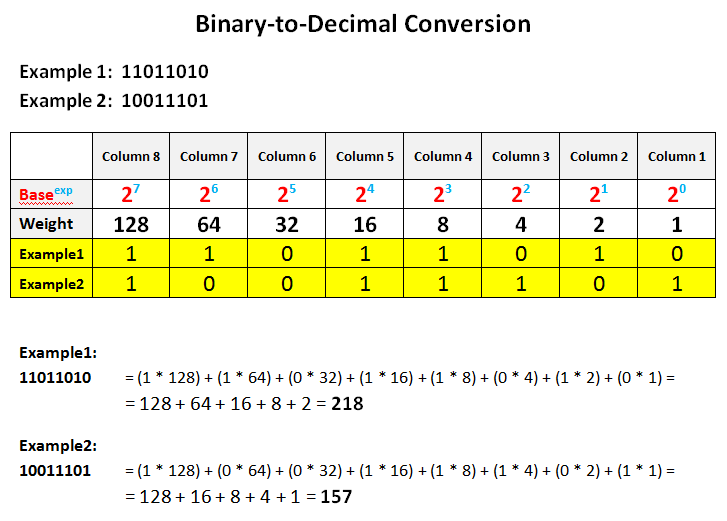
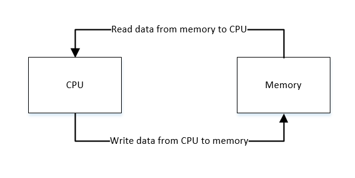

# How Computers Work
## What Makes a Computer, a Computer?  
All computers regardless of thier shape, look, price or equipment work the same through four stages:
1. Input
2. Storage
4. Processing Information
4. Output  
If it doeas all four, then it is a COMPUTER !

## Binary & Data
* At the core of each **Input**, **Storage**, **Process** and **Output**, there is two numbers: ***0*** and ***1***.  
* Thes zeros(0) and ones(1) generated from signal (electrical current) running through a wire.
* All computers at thier base function by **Binary** numbers
* Every thing in life (picture, videos, sounds..etc) can be transformed into **zeros** and **ones**
* At the base of all transformations there is the transformation from **binary** to **decimal**
  
## Circuits and Logic
* Computers modify and process binary numbers through **Logic  circuits**
* **Logic Circuits** can be added togather to produce more complex outcomes
  
## CPU, Memory, Input & Output
* Before an output is out, many interactions happen between the **Processor**(AKA :CPU) and **Memory**.
  
## Hardware and Software
* Hardware and Software work hand in hand whenever any operation on a computer is running.
* The Operating System(*Software*) tells the CPU (Hardware) what part of it , it must use, through a singal that is sent to the Operating System from a Hardware.     