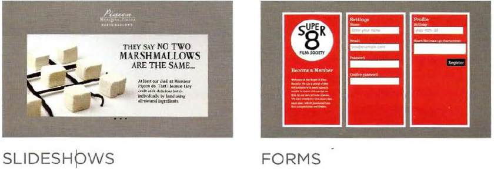
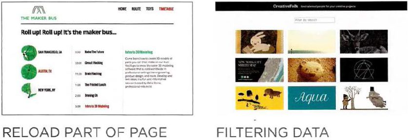

# Programming with JavaScript  
* JavaScript **JS** makes web pages more interactive. It can cause dynamic changes in the web page lements and style while viewing by:
    1. the ability to access any element of **HTML** or **CSS**
    2. modifying any element of  **HTML** or **CSS**
    3. creats systems, rules and procedures for the operation of web pages
    4. It makes the web page reactive for any event or change occurring  
The power of **JS** can be seen through the following examples:

  
* A **script** is a series of instructions that a computer can follow to achieve a goal.
* Writting a Script can be sliced into 3 pieces:
    1. DEFINE THE GOAL
    2. DESIGN THE SCRIPT
    3. CODE EACH STEP  

 