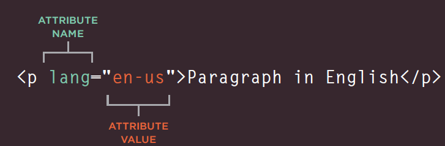

# HTMLK & CSS
## Structure  
* **HTML** describes the structure of pages
* **HTML** uses elements to describe the structure of pages, those elements consists of *tags* and tags (<>) consist of **attributes**  
   
    
* the main component of any **HTML** page are **`<head>`** **`<bode>`** **`<title>`** and these are necessery components
* You can use any text editor to write **HTML**  

## Extra Markup  
* **`<DOCTYPE html>` :** tells the browser that you are using a modern version of html
* **comments** : e use this tag `<!-- txt -->` to write comments
* ID Attribute: a style that only applys to a **single element**
* Class Attribute: a style that applies to **multible elemnts** share a certain feature  
* Block Elements: elements that are rendered inside a block
* Inline Elements: elements that are rendered in a line style
* Grouping Text & Elements In a Block: we can combine elements in a made up block using a tag called **`
`**
* Grouping Text & Elements Inline:  we can combine elements in a made up line using a tag called **``**  
* IFrames: we can show a part of a web site inside our web page by using a tage called **iframe**
* **`<meta>`** this element only exist inside the **head** element and give information about your site
* there are **Escape characters** that are used to include special characters in your pages such as <, >, and ©.  

## HTML5 Layout
* The new HTML5 elements i XX ndicate the purpose of different parts of a web page and help to describe its structure.
* The new elements provide clearer code (compared with using multiple `
`elements).
* Older browsers that do not understand HTML5 elements need to be told which elements are block-level elements.
* o make HTML5 elements work in Internet Explorer 8 (and older versions of IE), extra JavaScript is needed, which is available free from Google.  

## Process & Design  
* Designing the web site is fatal in increasing the number of visitors to your site
* You must know Who is the Site For 'either individual or companies' prior to design, and the need of its visitors and how to get the message right
* styling the site is very important for showing what is what, what is important and how to serve with minimal effort
* Navigation through the site must be easy and functional.  

Auther: Hatem Husnieh

