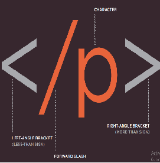

# Process & Design  
### Who is the Site For?  
One should design his/her web site putting in consideration 'others who are going to view it'.  
In that regard, some  questions should be **asked** and **answered**.  
#### If your target viewrs are **inividuals** then ?
* What is the age range o ●● f your target audience?
* Will your site appeal to more women or men? What is the mix?
* Which country do your visitors live in?
* Do they live in urban or rural areas?
* What is the average income of visitors?
* What level of education do they have?
* What is their marital or family status?
* What is their occupation?
* How many hours do they work per week?
* How often do they use the web?
* What kind of device do they use to access the web?  
####  If your target viewrs are **Companies** then?  
* What is the size of the company or relevant department?
* What is the position of people in the company who visit your site?
* Will visitors be using the site for themselves or for someone else?
* How large is the budget they control?  
### Why People Visit YOUR Website ?  
After knowing who are your visitors you should determine two things and answere thier related questions:  
Key Motivations | Specific Goals
--------------- | ---------------
Are they looking for general entertainment or do they need to achieve a specific goal? | Do they want general information / research (such as background on a topic / company), or are they after something specific (such as a particular fact or information on a product)?
 If there is a specific goal, is it a personal or professional one? | Are they already familiar with the service or product that you offer or do they need to be introduced to it?
 Do they see spending time on this activity as essential or a luxury? | Are they looking for time sensitive information, such as the latest news or updates on a particular topic?
 . | Do they want to discover information about a specific product or service to help them decide whether to buy it or not?
 . | Do they need to contact you? If so, can they visit in person (which might require opening hours and a map)? Or might they need email or telephone contact details?  
### What Your Visitors are Trying to Achieve ?  
In this step you're going to determine the reasons why your visitors have came to your web site  
'it's unlikely to know every other reason'  
### What Information Your Visitors Need?  
 Here you are going to afford for your visitors all the informations they need to achieve thier goals
 Here are some questions to help determine what information we need to afford  
* Will visitors be familiar with your subject area / brand or do you need to introduce yourself?
* Will they be familiar with the product / service / information you are covering or do they need background information on it?
* What are the most important features of what you are offering? 
* What is special about what you offer that differentiates you from other sites that offer something similar?
* Once people have achieved the goal that sent them to your site, are there common questions people ask about this subject area?  
### How Often People Will Visit Your Site ?  
It is necessary to update our web site. However, the duration of when to update is related to what serviece does the site provide.  
So here are some tips ti determine when to update the site:  
#### Goods / Services
* How often do the same people return to purchase from you?
* How often is your stock updated or your service changed?  
#### Information
* How often is the subject updated?
* What percentage of your visitors would return for regular updates on the subject, compared with those who will just need the information once?  
## Site Maps  
* Organizing all information in an easy and beautifull way is always hulpful  
* To know what information should go on each page, there is a technique called **card sorting**.
* Information are best put in sections
* Some information need to be dublicated if it needs to appear on more than one page. 
* The pages (or groups of pages) will inform how users navigate through the site.
* It is worth noting that the site owner might organize information in a way that is different to what the public expects. It is important to reflect the public's understanding of the subject (rather than just the site owner's understanding of it).  
  
## WireFrames  
It is a sketch to inform other what will be on a web ***page***/***site***  
  
## Getting your message across using design  
To get the message right there are 3 points to focus on:  
1. CONTENT  
 * A masthead or logo
 * Links to navigate the site
 * Links to related content and other popular articles
 * Login or membership options
 * Ability for users to comment
 * Copyright information
 * Links to privacy policies, terms and conditions, advertising information, RSS feeds, subscription options  
 2. Prioritizing  
 * If everything on a page appeared in the same style, it would be much harder to understand. (Key messages would not stand out.)
 * By making parts of the page look distinct from surrounding content, designers draw attention to (or away from) those items.
 * Designers create something known as a visual hierarchy to help users focus on the key messages that will draw people's attention, and then guide them to subsequent messages.  
 3. Organizing  
 * Grouping together related content into blocks or chunks makes the page look simpler (and easier to understand).
 * Users should be able to identify the purpose of each block without processing each individual item.
 * By presenting certain types of information in a similar visual style (such as using the same style for all buttons or all links), users will learn to associate that style with a particular type of content.  
 ## Visual Hierarchy  
Most people skim when viewing a text. For that reason some Hierarchy is required to help skimeers to skim !!  
We can diffrentiate words from each other by:  
* Size  
* Color
* Style  
* Adding images will help allot  
## Grouping and Similarity  
Grouping informations tegather in groups is a nature, and make the site easy to comprehend.  
Formations of groups are:
1. Proximity 
2. Closure 
3. Continuance 
4. White Space 
5. color 
6. Borders   
* help visitor by giving him/her similar style for related informations (Consistency)
* headings must be farmative to help user as possible as be.  
## Designing Navigation  
Nav.bars help visitors to move around the site and a good nav.bar consists of the following:
* Concise: quik and easy
* Clear: single descriptive words for each link
* Selective: no Functions like logins, search, legal information, etc.
* Context: let the user know were they are
* Interactive: either by size, color, appearence etc.
* Consistent: should not change with time

Auther: Hatem Husnieh

